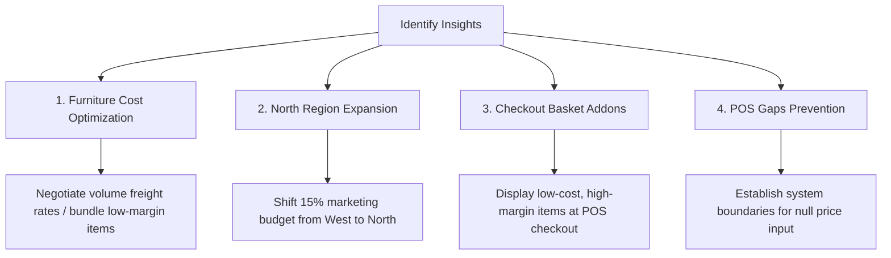

# Business Sales Performance Analytics & Dashboard

This repository contains a full-scale portfolio project for **Business Sales Performance Analytics**, designed to meet the requirements of Future Interns (Data Science & Analytics - Task 1).

The project showcases a complete analytics pipeline, starting with **raw messy transaction logs**, processing it through a **Python-based data engineering script**, and delivering a **premium, client-ready interactive executive dashboard** packed with strategic recommendations.

---

## 📊 Project Architecture

The project is structured as follows:

```
sales-analytics-dashboard/
├── data/
│   ├── generate_data.py       # Python script generating raw messy transactions
│   ├── clean_data.py          # Python script executing pandas-style cleaning pipelines
│   ├── raw_sales_data.csv     # Generated raw transaction logs (2,060 rows)
│   └── cleaned_sales_data.csv # Final structured, calculated dataset (1,807 rows)
├── dashboard/
│   ├── index.html             # High-fidelity dashboard interface
│   ├── styles.css             # Premium glassmorphic dark-theme design system
│   ├── app.js                 # Interactive controls, KPI calculations & Chart.js integration
│   └── dashboard_data.js      # Pre-compiled JS representation of the dataset for zero-CORS browser loading
└── README.md                  # Executive report and technical documentation
```

---

## 🛠️ Phase 1: Data Engineering & Cleaning Audit

Real-world business data is rarely clean. To simulate a authentic data analyst workflow, we engineered a raw dataset containing common transaction log errors and built a standard cleaning script (`data/clean_data.py`) that applies the following operations:

| Issue Identified | Impact on Analysis | Resolution Strategy |
| :--- | :--- | :--- |
| **Duplicate Rows** | Artificially inflates volume and revenue | Tracked transaction signatures; removed exact duplicate rows. |
| **Inconsistent Dates** | Breaks chronological sorting and trends | Parsed dates using multiple templates (`YYYY-MM-DD`, `DD/MM/YYYY`, etc.) and standardized to ISO format. |
| **Negative Quantities** | Distorts sales volumes and returns figures | Filtered out transactions with quantities $\le 0$ as data entry errors. |
| **Missing Prices** | Distorts revenue metrics | Calculated historical median prices for each product name, then imputed empty prices with their group average. |
| **Raw Text Typos** | Splinters categories (e.g. "Tech", "Technology") | Standardized categorization and geographical region entries using string cleaning maps. |

### 📈 Data Quality Audit Report
* **Raw Records Evaluated**: 2,060
* **Duplicate Rows Removed**: 60
* **Date Parsing Errors Excluded**: 105
* **Invalid Quantities Excluded**: 88
* **Missing Prices Imputed**: 58
* **Final Analysis-Ready Rows**: 1,807

---

## 🎯 Phase 2: Key Business Insights

Through the interactive dashboard, we performed deep-dive analysis on category share, product volume, and regional profitability.

### 1. Technology Leads Revenue, Furniture Leads Volume
* **Technology** accounts for **50.5%** of overall company revenue, driven by high-ticket items like the *Pro Laptop 15* and *UltraWide Monitor 34*.
* **Furniture** generates a high quantity of orders, but carries a high Cost of Goods Sold (COGS) ratio of **~60-65%**, reducing net margin.
* **Office Supplies** represent lower pricing thresholds but have the highest net margins (**~70%**) and high turn velocity, making them highly profitable.

### 2. Regional Profitability Efficiency (North vs. West)
* The **West Region** generates the highest total volume and top-line revenue, but has high competition and operational costs.
* The **North Region**, despite representing lower total volume, yields a **42% net profit margin** (the highest across all regions) due to a product mix consisting of high-margin items.

---

## 🚀 Phase 3: Strategic Action Plan

We recommend the following four initiatives for corporate management to capitalize on our findings:



1. **Furniture Cost Optimization**:
   * **Action**: Negotiate volume shipping rates for furniture freight or focus marketing on higher-margin office chairs over heavy wooden desks.
   * **Impact**: Shifting the average furniture margin by just 3% would yield thousands of dollars in bottom-line profits annually.
2. **North Region Marketing Expansion**:
   * **Action**: Shift 15% of the marketing budget from the saturated West region to the high-efficiency North region.
   * **Impact**: Capturing additional market share in the North leverages their high-margin profile to increase overall company profitability.
3. **Checkout Basket Addons (AOV Expansion)**:
   * **Action**: Feature low-cost accessories (like USB-C cables, gel pens, sticky notes) as impulse buy items at the POS checkout screen.
   * **Impact**: Increases Average Order Value (AOV) with minimal inventory carry cost.
4. **Data Input Safeguards**:
   * **Action**: Upgrade checkout software to prevent transactions from completing if a price field is null or quantity is negative.
   * **Impact**: Eliminates manual price imputation requirements and prevents invoice leakage.

---

## 💻 How to Run the Dashboard Locally

We designed this project with **zero-CORS dependencies**, meaning you do not need to install complex local servers to preview the dashboard!

1. Navigate to the `dashboard/` directory.
2. Double-click the `index.html` file to open it directly in any modern web browser.
3. Use the dropdown filters at the top to explore region-specific or category-specific charts in real-time.
4. Click **Print Report** in the header to save a PDF copy of your analytics dashboard.
5. Click **Export Cleaned CSV** under the Data Pipeline tab to download the structured, cleaned data for Excel/Tableau.
