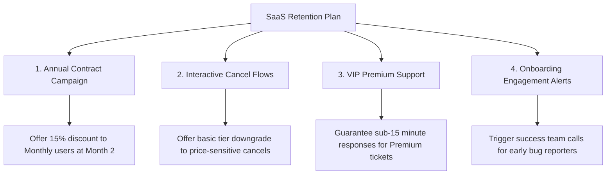

# Customer Retention & Churn Analytics Dashboard

This repository contains a full-scale portfolio project for **Customer Retention & Churn Analytics**, built to satisfy the requirements of Future Interns (Data Science & Analytics - Task 2).

The project showcases a complete analytics pipeline: starting with **messy raw customer transaction logs**, parsing and auditing it through a **Python-based data engineering script**, and deploying a **premium, interactive SaaS-focused Executive Churn Dashboard** loaded with specific retention strategies.

---

## 📊 Project Structure

The project is organized as follows:

```
customer-retention-analytics/
├── data/
│   ├── generate_churn_data.py # Python script simulating messy customer data
│   ├── clean_churn_data.py    # Python script performing cleaning & survival analysis
│   ├── raw_customer_data.csv  # Messy customer transactions (2,080 rows)
│   └── cleaned_customer_data.csv # Structured, audit-ready subscriber list (1,730 rows)
├── dashboard/
│   ├── index.html             # High-fidelity retention dashboard
│   ├── styles.css             # Premium glassmorphic HSL violet theme
│   ├── app.js                 # Event controller, KPI calculations & dynamic survival curve
│   └── dashboard_data.js      # Pre-compiled JS representation of dataset (no CORS issues)
└── README.md                  # Executive report and technical documentation
```

---

## 🛠️ Phase 1: Data Engineering & Quality Audit

Subscription databases often suffer from inconsistencies due to manual entry, checkout integrations, or timezone mismatches. The Python pipeline (`data/clean_churn_data.py`) standardizes raw columns and audits metrics:

| Field | Issue Identified | Impact | Resolution Strategy |
| :--- | :--- | :--- | :--- |
| **Signup_Date** | Mixed date templates | Breaks cohort assignment | Normalizes dates to `YYYY-MM-DD` using multiple parsing patterns. Drops invalid/blank dates. |
| **Tenure_Months** | Negative/null values | Distorts LTV & lifespan | Excludes customer rows where tenure is negative or empty. |
| **Monthly_Charges** | Missing/null costs | Zero-out calculated LTV | Imputes missing charges using the median cost for that Plan Type. |
| **Billing_Cycle** | Missing cycles | Disrupts contract analysis | Defaults blank cycles to "Monthly" (the industry default billing method). |
| **Plan / Churn Flags** | Text case mismatches | Splinters segments | Standardizes strings to canonical text (e.g. "basic", "BASIC" $\rightarrow$ "Basic"). |

### 📈 Data Quality Audit Report
* **Raw Profiles Evaluated**: 2,080
* **Duplicate Rows Removed**: 80
* **Date Parsing Errors Excluded**: 219
* **Invalid Tenures Excluded**: 51
* **Missing Charges Imputed**: 32
* **Billing Cycles Imputed**: 90
* **Final Analysis-Ready Rows**: 1,730

---

## 🎯 Phase 2: Cohort & Survival Rate Findings

We calculated Customer Survival Curves to see how retention rates behave across customer tenure:

### 1. The Month 3 Attrition Cliff
* Our analysis shows a **steep drop in retention rate during the first three months** of tenure. 
* Customers who survive past **Month 6** show a **92% survival rate** through Month 24. Early churn is caused by poor onboarding and initial product friction.

### 2. Monthly Contract Vulnerability
* **Monthly Billing Cycle** subscribers are **4 times more likely to churn** than Annual Contract holders. Monthly billing represents **78%** of total cancellations.

### 3. High-Value Premium Attrition
* Premium accounts ($79/mo) account for the highest total lost MRR. Their primary reason for leaving is **Customer Support** issues, whereas Basic users leave due to **Price**.

---

## 🚀 Phase 3: Actionable SaaS Retention Plays

We recommend the following four initiatives to protect recurring revenue:



1. **Annual Commitments Upgrades**:
   * **Action**: Launch an automated prompt at Month 2 offering a 15% discount if the customer upgrades to an Annual plan.
   * **Impact**: Shifting 10% of monthly users to annual terms secures cash flow and reduces annual churn by ~40%.
2. **Interactive Cancel Downgrade Flows**:
   * **Action**: Implement a cancel flow that redirects price-sensitive cancel requests to a discounted plan or Basic downgrade offer.
   * **Impact**: Saves up to 15% of price-churning users by downselling instead of completely losing them.
3. **Redesigned Premium Support Pipelines**:
   * **Action**: Create a prioritized support queue for Premium tier subscribers, guaranteeing a response under 15 minutes.
   * **Impact**: Directly protects high-ticket LTV accounts, where a single lost Premium user has the financial impact of five Basic users.
4. **Early Onboarding success alerts**:
   * **Action**: Monitor event tracking. If a new user logs a bug report or shows low feature usage in their first 14 days, trigger a customer success follow-up call.
   * **Impact**: Resolves product friction during the critical first month, flattening the early survival curve.

---

## 💻 How to Run the Dashboard Locally

This dashboard has **zero CORS restrictions** and runs entirely locally.

1. Navigate to the `dashboard/` directory.
2. Double-click the `index.html` file to open it in your browser.
3. Use filters at the top to explore region-specific or billing-specific retention metrics.
4. Click **Print Executive Summary** in the header to export the charts as a PDF.
5. Click **Export Cleaned CSV** under the Data Pipeline tab to save the analysis-ready customer records.
